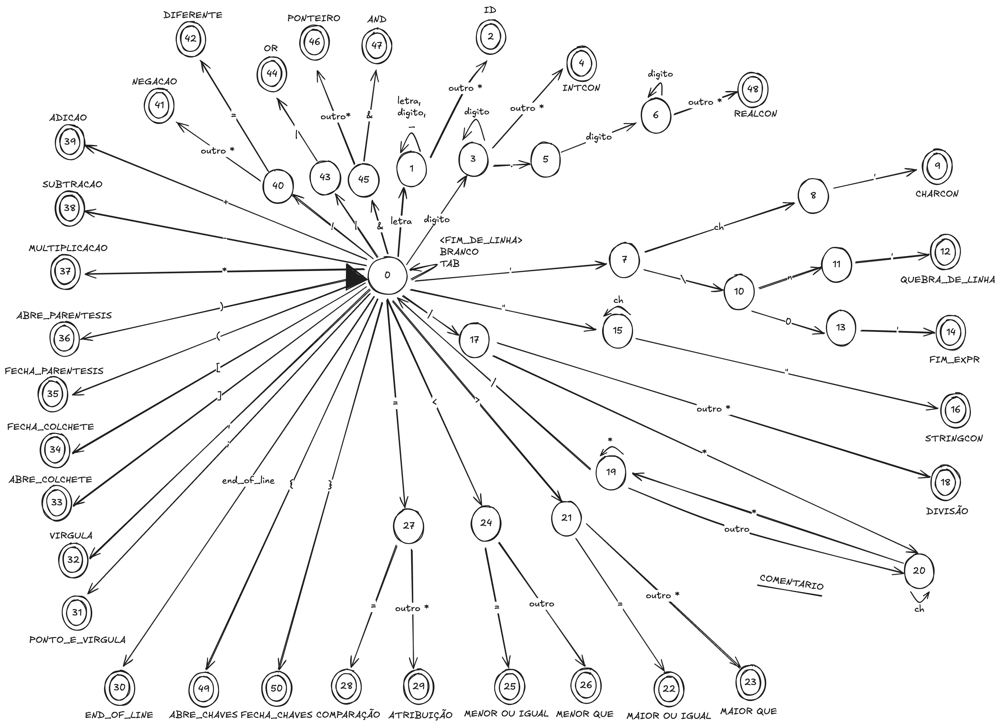

## Como rodar
para gerar o arquivo do analisador lexico execute:

`gcc Analex.c tabela_simbolos.c cshort.c -o analex`

para rodar o arquivo do analisador lexico execute:
`./analex`

Você pode executar em um comando só:

`gcc Analex.c tabela_simbolos.c cshort.c -o analex && ./analex`

## AFD
